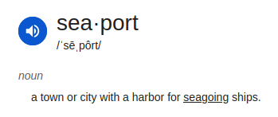

# seaport



Seaport sets up port forwarding to allow directly reaching services, whether that be torrent clients, web servers, or games. In many cases, port forwarding will make connectivity possible where it was not before, leading to better utilization and lower latency. If the port changes, seaport will update your client and optionally notify you.

Seaport is modular. If you know of an environment that seaport should support, please file a ticket or submit a PR.

## Quick Start

First create your config file and save it as *seaport.yaml*. Then copy/paste one config block example below.

**For protonvpn with qbittorent**

```yaml
source:
  name: "protonvpn"

actions:
  - name: qbittorrent
    options:
      # adjust the options here if you have changed the qbittorrent defaults
      host: http://localhost:8080
      username: admin
      password: adminadmin
```

**For getting a port from your router (or generic vpn) with qbittorent**

```yaml
source:
  name: "natpmp"
  options:
    # gatewayIP is where to send the nat-pmp request
    gatewayIP: <insert gateway>

actions:
  - name: qbittorrent
    options:
      # adjust the options here if you have changed the qbittorrent defaults
      host: http://localhost:8080
      username: admin
      password: adminadmin
```

## Building

In order to build, you'll need to install packages.

Ubuntu
```
sudo apt install make golang-go
```

and build

```
go build
```

Assuming your `seaport.yaml` is ready, start the service.

```
./seaport -config seaport.yaml
```

## Verification

Once you have seaport running _and_ your service (web server, torrent client, game) is bound to the port, you can verify
port forwarding is working as expected by visiting a site like https://canyouseeme.org/ and inputting the IP+port.

## Installation

If the service is working as expected, you can run the make target `setup` to perform all install steps. Seaport will begin running now and will start on boot.

* Build the binary
* Install to /usr/local/bin/seaport
* Create /etc/seaport/seaport.yaml (copied from your current working directory)
* Create a systemd unit, enable at boot, and start it

```
sudo make setup
```

To verify operation, check the output of

```
sudo systemctl status seaport
```

## Releases

Download the latest release from github releases.

## Key Concepts

_Sources_ are where IP+port comes from for port forwarding. Usually from your infrastructure, like your router or VPN provider.

_Actions_ are plugins that automatically configure external clients using programmatic means, like your torrent client. You may need at least one action for seaport to be useful to you.

_Notifiers_ are optional ways to send human-readable updates.

You can only have one source, but many actions or notifiers.

## Full Config Example

See [seaport-example.yaml](seaport-example.yaml).

## Supported Plugins

### Sources

#### protonvpn

No configuration needed.

```yaml
source:
  name: protonvpn
```

#### natpmp

```yaml
source:
  name: natpmp
  options:
    gatewayIP: <IP>

    #####################
    # optional attributes
    #####################

    # externalPort is the suggested external port to expose on the router. Per nat-pmp, the router may choose to return
    # the suggested port or a different external port than the one requested.
    # In some cases, non-compliant NAT-PMP implementations will fail if externalPort is zero.
    externalPort: <int>

    # internalPort maps the service directly to a static port bound on this node. Useful for docker containers hosting
    # services that are not port-aware. May be left unspecified.
    internalPort: <int>

    # randomPort determines whether seaport itself generates a random port between 30000-60000 instead of relying on the router
    # Default: false
    randomPort: <boolean>

    # lifetime specifies how long the port mapping should last.
    # Default: 60s
    # Should be a duration with a time suffix, like 60s, 1h, 1d
    lifetime: <duration>
```

NAT-PMP servers frequently implement the spec wrong and behavior will vary.

**Known working configs**

Synology RT2600AC:
```
source:
  name: natpmp
  options:
    gatewayIP: 192.168.1.1
    randomPort: true
```

When requesting a specific port, note that the Synology incorrectly requires the `internalPort` not be zero.

```
source:
  name: natpmp
  options:
    gatewayIP: 192.168.1.1
    externalPort: 1234
    internalPort: 1234
```

### Actions

#### qbittorrent

```yaml
actions:
  - name: qbittorrent
    options:
      host: http://localhost:8080
      username: admin
      password: adminadmin
```

### Notifiers

#### discord

```yaml
notifiers:
  - name: discord
    options:
      webhook: <insert your webhook URL here like https://discord.com/api/webhooks/...>
```

Alternatively you can specify the webhook by setting the environment variable `SEAPORT_DISCORD_WEBHOOK`.
